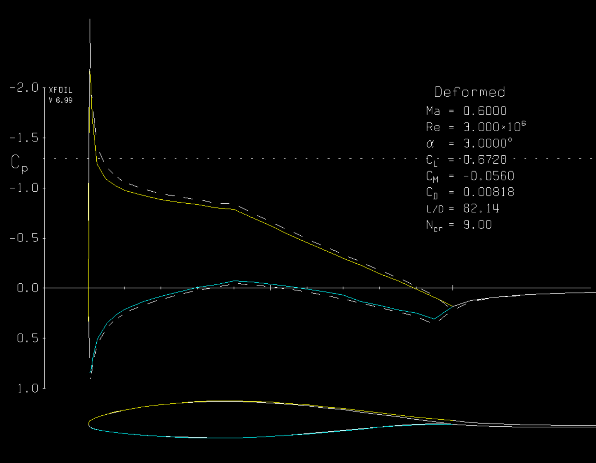
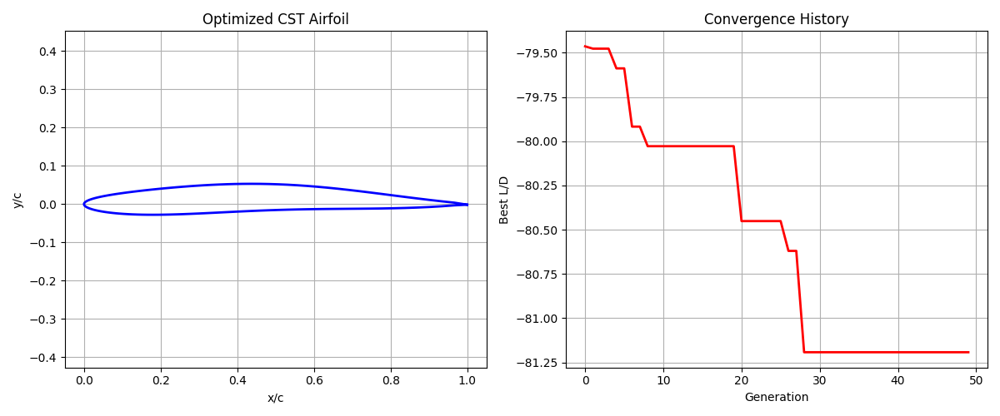

# Airfoil Optimization Using XFoil & Python Genetic Algorithm

A Python-based aerodynamic shape optimization code for 2D airfoils at transonic conditions (Mach 0.6, Re = 3e6). Two approaches are implemented: (1) deformation of NACA 64-210 using Bernstein polynomials, and (2) pure CST parameterization from scratch.

Restrictions such as thickness are added so that the generated airfoils are realistic for real-world engineering.

## Features

- **NACA 64-210 Deformation**: Perturb the baseline airfoil with smooth Bernstein basis functions
  - Objective 1: Maximize L/D only
  - Objective 2: Maximize L/D while constraining CD < baseline CD
- **Pure CST Parameterization**: Generate airfoils from scratch
- **Genetic Algorithm**: Population-based optimization with tournament selection, uniform crossover, and Gaussian mutation
- **XFoil Integration**: Automated aerodynamic analysis

## Results Summary

| Method | Objective | Best L/D | CD | CL |
|--------|-----------|----------|----|----|
| NACA Deform | Max L/D | 84.79 | 0.00839 | 0.7112 |
| NACA Deform | Max L/D + CD Constraint | 82.14 | 0.00818 | 0.6720 |
| Pure CST | Max L/D | 81.21 | 0.00713 | 0.5789 |

## Requirements

- Python 3.8+
- XFoil 6.99

### XFoil Settings

Mach: 0.6
Reynolds: 3e6
Alpha: 3.0 degrees

## Results Visualization

Example 1: deformed NACA 64-210 with drag coefficient lower than original and maximized lift-drag ratio

Example 2: CST optimized airfoil shape and lift-drag ratio history

